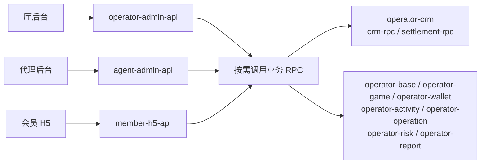

# P9 厅侧仓库与服务划分

本文说明 P9 厅侧当前确定的仓库划分、业务职责和服务组织方式，供开发分工与工程建设参考。

## 一、整体划分

厅侧共 **11 个 Git 仓库：8 个业务仓库 + 3 个客户端 API 仓库**。

### 业务仓库

| 仓库 | 主要职责 |
|---|---|
| `operator-base` | 厅基础资料、基础配置及初始化 |
| `operator-crm` | 会员、分层代理、全民代理及代理结算 |
| `operator-game` | 游戏业务及注单相关处理 |
| `operator-wallet` | 会员及代理钱包、资金账务、充值提现和第三方支付 |
| `operator-activity` | 活动管理、任务管理、会员参与及奖励管理 |
| `operator-operation` | 广告、渠道、公告、客服及日常运营 |
| `operator-risk` | 风险规则、风险识别及风控处置 |
| `operator-report` | 经营、会员、代理、游戏及财务统计报表 |

### 客户端 API 仓库

| 仓库 | 服务对象 | 主要职责 |
|---|---|---|
| `operator-admin-api` | 厅后台 | 接口接入、认证权限、请求处理及业务 RPC 调用 |
| `agent-admin-api` | 代理后台 | 接口接入、认证权限、请求处理及业务 RPC 调用 |
| `member-h5-api` | 会员 H5 | 接口接入、身份认证、请求处理及业务 RPC 调用 |

三个 API 按客户端划分，具体业务规则由对应的业务服务处理；各 API 根据实际功能按需调用 RPC。

## 二、CRM 服务划分

`operator-crm` 将会员、分层代理、全民代理及代理结算整合在同一仓库，采用 go-zero 多服务项目布局。

- **一个 Git 仓库、一个 Go Module**。
- **共用一套 Ent 数据模型**，连接厅数据库 `p9_operator`。
- **两个独立 RPC 进程**，可分别构建、部署和扩容。

| RPC 服务 | 业务范围 |
|---|---|
| `crm-rpc` | Member（会员）、Agent（分层代理）、Affiliate（全民代理） |
| `settlement-rpc` | Settlement（代理收益核算、成本分摊、结算审核及管理） |

规划中的工程目录：

```text
operator-crm/
├── go.mod
├── ent/                        # 共用 Ent
├── service/
│   ├── crm/
│   │   └── rpc/                # Member、Agent、Affiliate
│   └── settlement/
│       └── rpc/                # Settlement
├── Makefile
└── README.md
```

以上为目录规划，生成代码、端口和部署配置在工程初始化时按 P9 规范落实。

## 三、钱包与支付

`operator-wallet` 统一负责钱包与支付业务，不再单独维护 `operator-payment` 仓库。

| 业务模块 | 主要职责 |
|---|---|
| Wallet | 钱包账户、余额、资金流水及资金账务 |
| Payment | 充值提现、支付渠道、第三方支付对接及支付订单 |

两个业务模块保留各自职责，是否拆分独立运行进程由后续实际需求决定。

## 四、主要调用关系



图中“按需调用业务 RPC”仅表示调用关系，**不是额外的网关或服务进程**。各 API 直接调用所需 RPC，不要求接入全部业务服务。

业务服务按职责维护数据；跨服务协作通过明确的业务接口完成。**共用仓库和 Ent 不代表跨 RPC 调用自动共享数据库事务**。

## 五、本次仓库调整

| 不再单独维护的仓库 | 合并归属 |
|---|---|
| `operator-member` | `operator-crm` |
| `operator-agent` | `operator-crm` |
| `operator-affiliate` | `operator-crm` |
| `operator-settlement` | `operator-crm` |
| `operator-payment` | `operator-wallet` |

其他业务仓库与三个客户端 API 仓库保持独立。本文件记录已确定的架构划分，不代表全部服务均已完成开发或部署。
